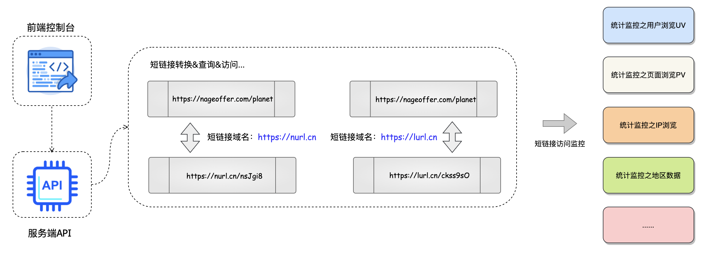
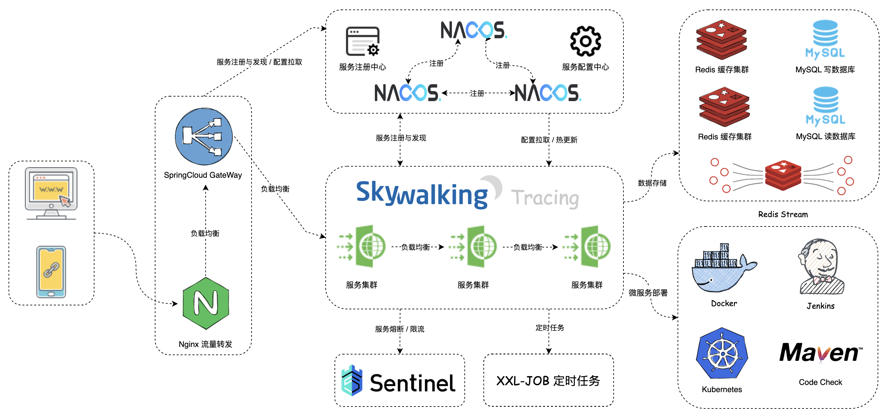

# shortlink
短连接转换

## 项目描述
短链接（Short Link）是指将一个原始的长 URL（Uniform Resource Locator）通过特定的算法或服务转化为一个更短、易于记忆的 URL。短链接通常只包含几个字符，而原始的长 URL 可能会非常长。
短链接的原理非常简单，通过一个原始链接生成个相对短的链接，然后通过访问短链接跳转到原始链接。

## 系统架构
在系统设计中，采用最新 JDK17 + SpringBoot3&SpringCloud 微服务架构，构建高并发、大数据量下仍然能提供高效可靠的短链接生成服务。

